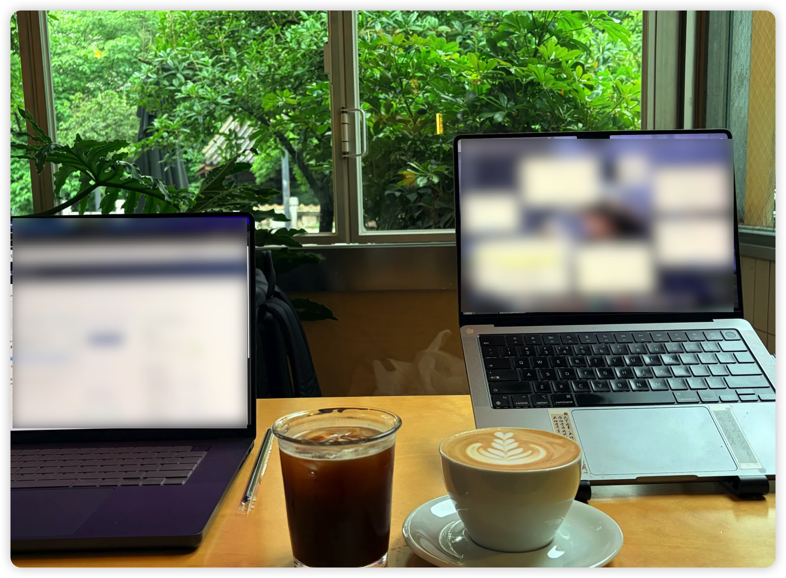

This site has been a while in the making ☕

It started on April 27th, in a café somewhere on my graduation trip. I opened up Cursor and just… started vibe coding. Turned out to be surprisingly, almost unreasonably effective 🤩. My partner was sitting right beside me the whole time, which made it even better. We were traveling, but we had this quiet habit of carving out a little time each day for something creative or exploratory.

After the trip, I came back to the site occasionally—tweaking, refining, nudging things into place—until today, when it finally feels like what I had in mind. So: it's live 🚀

I don't think it's perfect. I don't think it ever will be—and honestly, that's fine 😄. I'll keep improving it as I go. If you spot anything off, or have a suggestion, I'd genuinely love to hear it. You can find my contact details on the About page 👋

The café where it all started — Guiyang, Guizhou, China, April 27, 2026.
